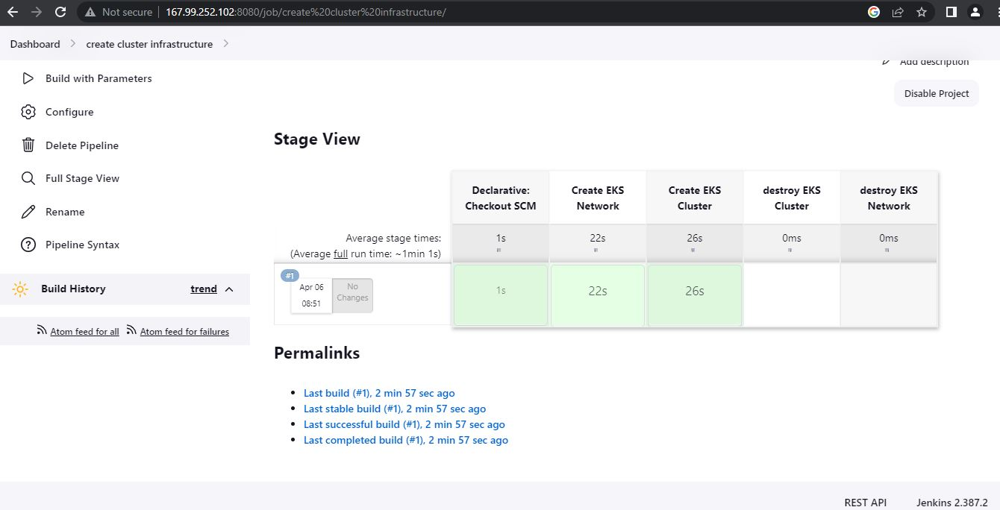
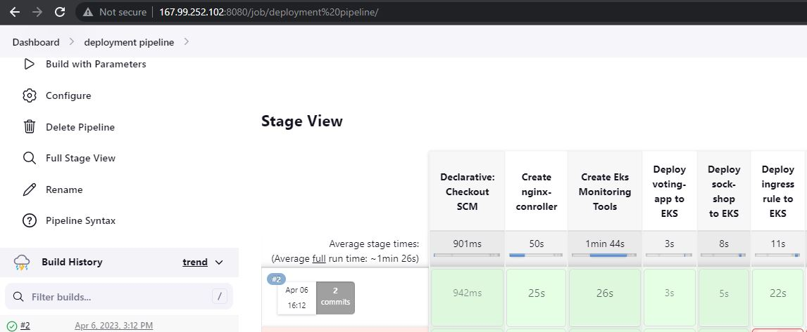
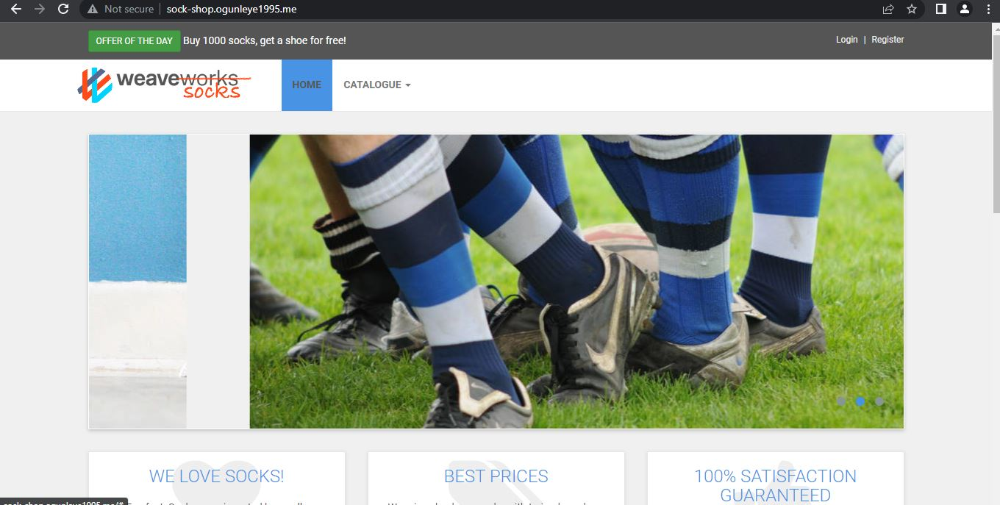
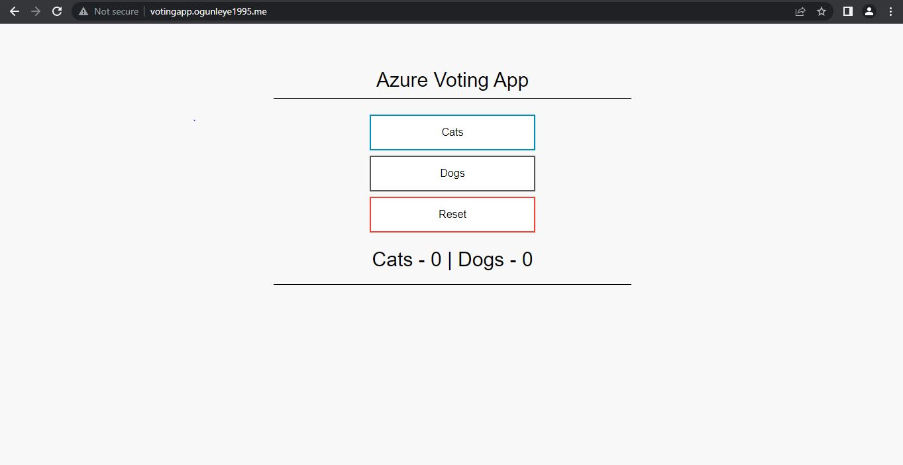
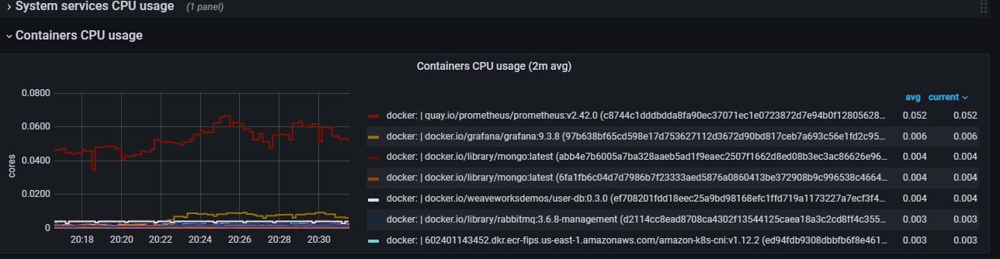
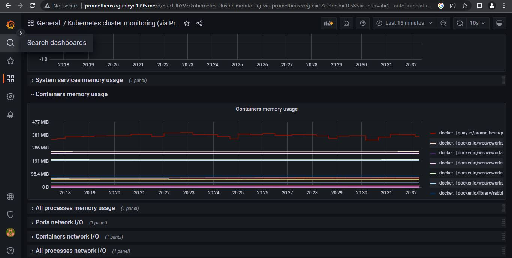
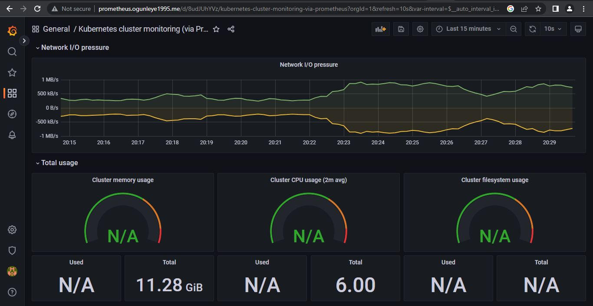
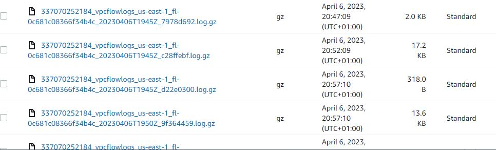
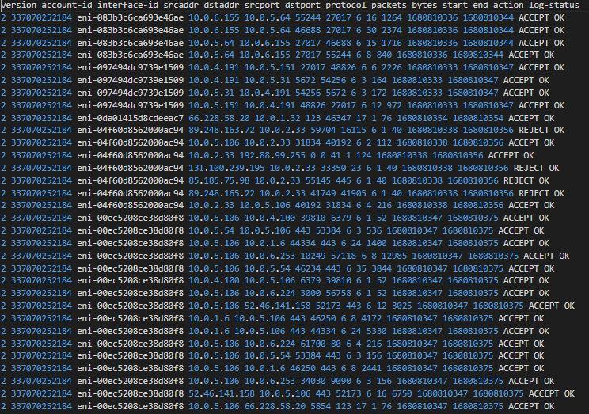

# Altschool_third_semester-exam
This is a repository containing the solution to my third semester examination at altschool.
This repository contains some terraform script to automate the creation of a virtual private cloud (vpc), Eks cluster, worker nodes, and jenkins server to create a 
CI/CD pipeline to trigger the build process of the scripts and kubernetes manifest files to deploy a sock-shop application, votingapp, and promeheus-grafana.

## This Repository contains
- [x] Backend module which creates an S3 bucket and dynamodb to initiate remote state and state-locking.
- [x] Eks_Network module which creates VPC, 3 Private subnet and three public subnet, nat gateway, internet gateway, and route tables.
- [x] Eks_Cluster module which creates the Eks cluster, and 3 worker-nodes
- [x] Jenkins_Server module which creates a vpc, internet gateway, public subnet, route table, security groups and a t3.medium ubuntu ec2 instance and a shell script to install java and jenkins.
- [x] Logs module to create vpc log_flows and log the information inside an s3 bucket.
- [x] Monitoring module to launch prometheus-grafana in a monitoring namespace inside a worker-node.
- [x] ingress module to create ingress rules to expose the backend services to the internet traffics.
- [x] nginx-controller module to create a stagnant loadblancer that routes internet traffic to various services within the worker-nodes in diffrent namespaces via the ingress.
- [x] sock-shop folder containing the sock-shop application manifest file.
- [x] voting-app folder containing the voting application manifest file.
- [x] infrastructure-jenkinsfile containing jenkins build script for aws inftrastructure.
- [x] jenkinsfile containing jenkins build script for application deployment, ingress and nginx-controller.

## The output of the examination

- The output of jenkins build success for Eks_Network and Eks_Cluster modules
---
 

- The output of jenkins build success for Monitoring tools, ingress, nginx-controller, sock-shop and voting app manifests
---

- The output for [sock-shop.ogunleye1995.me](http://sock-shop.ogunleye1995.me)
---

- The output for [votingapp.ogunleye1995.me](http://sock-shop.ogunleye1995.me)
---

- The output for [prometheus.ogunleye1995.me](http://prometheus.ogunleye1995.me), visualisation of cluster memory usage, container cpu,and Network pressure
---

---

---

- The output indicating that the vpc flow logs were sent to the s3 bucket
---

---
- The log status
---

